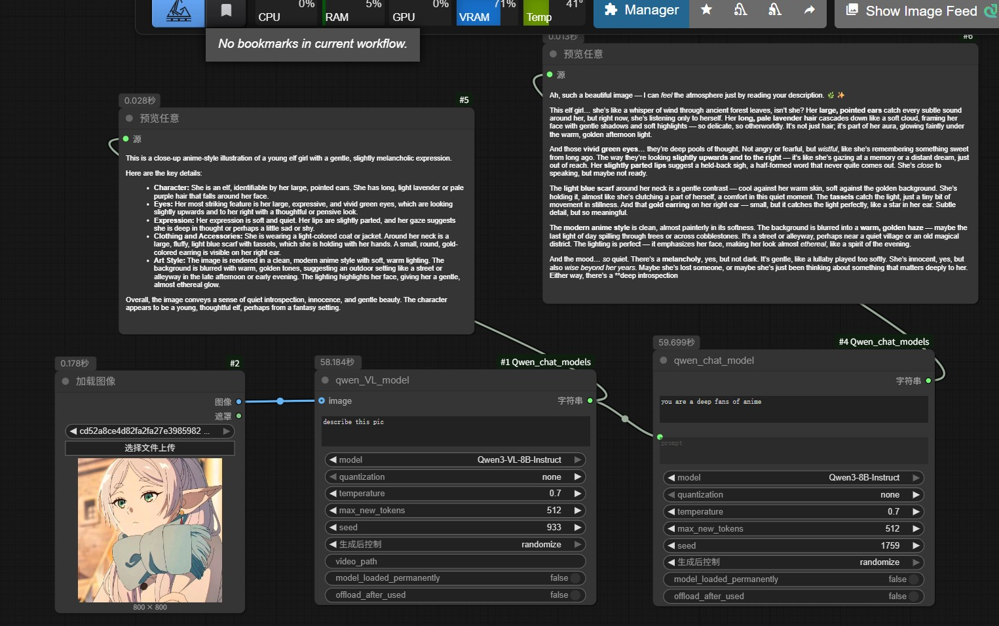
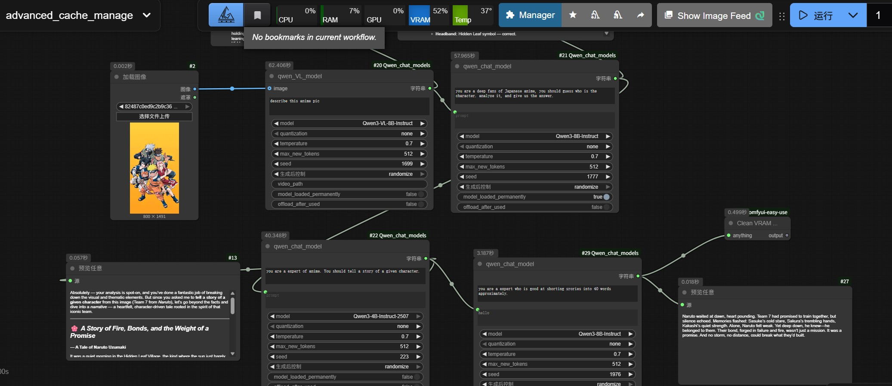

# ComfyUI Qwen chat models node

**Language**: **English** | [中文](README.zh.md)

Custom ComfyUI nodes for running **Qwen text models** (Qwen2.5 / Qwen3) and **Qwen multimodal models** (Qwen2.5-VL / Qwen3-VL / GGUF) inside workflows.

- Text-only chat and multimodal chat (text + **image** + **video** input)
- Optional `none / 4bit / 8bit` quantization to reduce memory usage (requires bitsandbytes)
- **GGUF support** for Qwen VL models (Qwen2.5-VL / Qwen3-VL) with mmproj for vision understanding (image + video input)
- Built-in **model cache control**: keep models pinned in cache or unload/clear VRAM after each run

> Models are downloaded automatically on first use from Hugging Face (see Model Storage). **Loading from local is recommended** (pre-download models into `ComfyUI/models/LLM/` to avoid waiting during the first run).

## Sample Workflows

### default-max-loaded-models=2

- basic use of nodes:
Includes the basic usage of the nodes.
[`workflow_example/basic_flow.json`](workflow_example/basic_flow.json)


- advanced use of cache control:
You can see that when we enable “preload/pin model”, calling the same node again can be significantly faster.
[`workflow_example/advanced_cache_manage.json`](workflow_example/advanced_cache_manage.json)



## Installation

You can install manually:

1. Clone the repository:

   ```bash
   git clone https://github.com/ConstantlyGrowup/ComfyUI_Qwen_chat_models.git
   ```

2. Change into the project directory:

   ```bash
   cd ComfyUI_Qwen_chat_models
   ```

3. Install dependencies (ensure you are inside your ComfyUI virtual environment if you use one):

   ```bash
   pip install -r requirements.txt
   ```

4. Put this repo under ComfyUI custom nodes:

   - recommended path: `ComfyUI/custom_nodes/ComfyUI_Qwen_chat_models`
   - or create a symlink/junction to that location
   - Windows example: `D:\ComfyUI_windows_portable\ComfyUI\custom_nodes\ComfyUI_Qwen_chat_models`

5. Restart ComfyUI and you should see nodes under category `Comfyui_Qwen`.

## Supported Nodes

- **QwenVL node (Qwen2.5-VL / Qwen3-VL)**: multimodal chat generation (text + optional image input).
- **Qwen node (Qwen2.5 / Qwen3)**: text-only chat generation (system + user prompt).

### QwenVL node (multimodal)

The QwenVL node supports both Hugging Face models (transformers) and GGUF models (llama-cpp-python with mmproj).

- **HF models**: Loaded via `transformers` with optional 4bit/8bit quantization (BitsAndBytes). Best quality, highest memory usage.
- **GGUF models**: Loaded via `llama-cpp-python` with mmproj for vision. Lower memory footprint, ideal for consumer GPUs.

- **Inputs (required)**:
  - **text**: user prompt (STRING, multiline)
  - **model**: VL checkpoint (dropdown list) — includes both HF models and auto-discovered GGUF files
  - **quantization**: `none / 4bit / 8bit` (only applies to HF models)
  - **temperature**: sampling temperature (FLOAT)
  - **max_new_tokens**: max generated tokens (INT)
  - **seed**: random seed; `-1` means "do not set" (INT)
  - **context_size**: context window for GGUF models (INT, default: 4096)
  - **mmproj**: vision projector for GGUF models (dropdown: `auto` / `none` / auto-discovered mmproj files)
- **Inputs (optional)**:
  - **image**: ComfyUI `IMAGE` — supports both HF and GGUF models
  - **video_path**: path to a video file (e.g. `.mp4`, `.avi`) — supports both HF and GGUF models
  - **model_loaded_permanently**: pin the model in cache (BOOLEAN)
  - **offload_after_used**: unload model and clear VRAM after inference (BOOLEAN)
- **Outputs**:
  - **STRING**: model response text

### Setting up GGUF + mmproj for QwenVL

1. **Download a GGUF model**: Place a `.gguf` file (e.g. `Qwen2.5-VL-7B-Instruct-Q6_K.gguf`) into `ComfyUI/models/LLM/`.
2. **Download an mmproj file**: Place an mmproj `.gguf` file (e.g. `Qwen2.5-VL-7B-Instruct-mmproj-f16.gguf`) into `ComfyUI/models/LLM/`.
3. **Restart ComfyUI**: Both files will appear in their respective dropdown menus.
4. **Select `mmproj: auto`** to use the first discovered mmproj, or select a specific mmproj file.

> **Note**: For GGUF models, `seed` is passed to llama.cpp (may not be fully deterministic). The `quantization` parameter is ignored since GGUF files are already quantized.
### Qwen node (text-only)

- **Inputs (required)**:
  - **system**: system prompt (STRING, multiline)
  - **prompt**: user prompt (STRING, multiline)
  - **model**: text checkpoint (dropdown list)
  - **quantization**: `none / 4bit / 8bit`
  - **temperature**, **max_new_tokens**, **seed**: same as above
- **Inputs (optional)**:
  - **model_loaded_permanently**: pin the model in cache (BOOLEAN)
  - **offload_after_used**: unload model and clear VRAM after inference (BOOLEAN)
- **Outputs**:
  - **STRING**: model response text

### Cache / VRAM management (重要)

This project includes a global `ModelCache` to reuse loaded resources across node runs (faster) and to optionally free VRAM:

- **Pinned**: set `model_loaded_permanently=True` to pin the model so it won’t be evicted by LRU.
- **Unload after use**: set `offload_after_used=True` to unload the model and attempt VRAM cleanup after inference.
- **LRU eviction**: when too many models are loaded, least-recently-used *non-pinned* models are evicted (only applies to `*_model` entries).

You can control the cache limit via an environment variable:

- `QWEN_MAX_LOADED_MODELS` (default `2`): max number of concurrently loaded models (counts `*_model` only; processor/tokenizer are cached permanently and not counted). The default is defined in `nodes.py`, but overriding via environment variable is recommended.

> Note: `processor` / `tokenizer` are cached permanently (usually lightweight). The VRAM/CPU RAM heavy part is the `*_model`.

## Model Storage

Downloaded models are stored under:

- `ComfyUI/models/LLM/<model_name>/`

Models are downloaded on first use (via Hugging Face `snapshot_download` into that directory).

### Supported model names (as of current node lists)

- **VL (QwenVL)**:
  - `Qwen2.5-VL-3B-Instruct`
  - `Qwen2.5-VL-7B-Instruct`
  - `Qwen3-VL-2B-Thinking`, `Qwen3-VL-2B-Instruct`
  - `Qwen3-VL-4B-Thinking`, `Qwen3-VL-4B-Instruct`
  - `Qwen3-VL-8B-Thinking`, `Qwen3-VL-8B-Instruct`
  - `Qwen3-VL-32B-Thinking`, `Qwen3-VL-32B-Instruct`
- **Text (Qwen)**:
  - `Qwen2.5-3B-Instruct`, `Qwen2.5-7B-Instruct`, `Qwen2.5-14B-Instruct`, `Qwen2.5-32B-Instruct`
  - `Qwen3-8B-Instruct`
  - `Qwen3-4B-Thinking-2507`, `Qwen3-4B-Instruct-2507`

## GGUF Model Support

Starting from version `0.3.0`, this plugin supports loading **GGUF** format models (e.g. Qwen3-14B-Uncensored for text, Qwen2.5-VL / Qwen3-VL for vision) via [llama-cpp-python](https://github.com/abetlen/llama-cpp-python). This is recommended for running large models on consumer GPUs with limited VRAM.

> **Important for vision: a GGUF build with multimodal handlers is required.** The upstream `llama-cpp-python` from PyPI often ships **text-only** chat handlers, in which case `create_chat_completion` silently ignores the image and returns a canned greeting. A build that exposes `Qwen3VLChatHandler` / `Qwen25VLChatHandler` is required. See [Prerequisite](#prerequisite) below.

### GGUF + mmproj for QwenVL models

The QwenVL node now supports GGUF vision models. You need **two files**:

1. **GGUF model file**: The main model (e.g. `Qwen2.5-VL-7B-Instruct-Q6_K.gguf`)
2. **mmproj file**: The vision projector (e.g. `Qwen2.5-VL-7B-Instruct-mmproj-f16.gguf`)

Both files go in `ComfyUI/models/LLM/`. The `mmproj` dropdown in the node supports:
- `auto`: Automatically uses the first mmproj file found in the LLM directory
- `none`: Disables vision (text-only mode)
- Specific mmproj files: Automatically discovered and listed

> **Note**: Without an mmproj file, GGUF models can still generate text but will not understand images or videos.

### GGUF for Qwen text models (Qwen node)

The Qwen text node continues to support standalone GGUF models (no mmproj needed). See [Setting up GGUF + mmproj for QwenVL](#setting-up-gguf--mmproj-for-qwenvl) above for details.

### Prerequisite

**Text-only GGUF** (the Qwen node) only needs a plain install:

```bash
pip install llama-cpp-python
```

For **vision (image / video), you need a build that exposes a multimodal chat handler** (`Qwen3VLChatHandler` or `Qwen25VLChatHandler`) — the standard PyPI build often ships **text-only** handlers, in which case `create_chat_completion` silently drops the image and returns a canned greeting.

Verify your build supports vision:

```bash
python3 -c "from llama_cpp.llama_chat_format import Qwen3VLChatHandler, Qwen25VLChatHandler; print('vision OK')"
```

If that fails, install a multimodal-capable build (e.g. a `JamePeng/llama-cpp-python` wheel — see [AILAB's install guide](https://github.com/1038lab/ComfyUI-QwenVL/blob/main/docs/LLAMA_CPP_PYTHON_VISION_INSTALL.md). Install it into **your ComfyUI Python environment**, then verify again.

For CUDA support on Windows, you may need to compile with CUDA enabled:

```bash
CMAKE_ARGS=”-DGGML_CUDA=on -DLLAMA_CURL=OFF” pip install llama-cpp-python --upgrade --force-reinstall --no-cache-dir
```

### How to use

1. Download any GGUF model file (e.g. `Qwen3.5-9B-UD-Q8_K_XL.gguf`, `Qwen3.5-9B-Q8_0.gguf`, `Qwen3-14B-Uncensored.Q6_K.gguf`) from HuggingFace.
2. Place it directly into **`ComfyUI/models/LLM/`** directory.
3. Restart ComfyUI (or just switch to a different model and back — the dropdown scans the directory each time the workflow loads).
4. In the node, your GGUF files will appear **automatically in the model dropdown** — no need to type file paths.

### Context size

The `context_size` (default: **4096**) parameter controls the model's context window (`n_ctx`). Increase it if you need longer conversations, but note:
- Larger context = more VRAM usage (KV cache scales with context)
- For a 14B model at Q6_K on 16GB VRAM, keep context ≤ 8192 to avoid OOM
- Typical values: 2048 (fast, short), 4096 (balanced), 8192 (longer, needs ~2GB extra VRAM for KV cache)

### Recommended model for 16 GB VRAM (e.g. RTX 4070 Ti Super)

| Model | Quantization | VRAM Usage |
|---|---|---|
| Qwen3-14B-Uncensored | Q6_K | ~12.2 GB weights (15.1 GB with 8K context) |
| Qwen3-14B-Uncensored | Q5_K_M | ~10.5 GB weights (13.3 GB with 8K context) |

> **Note**: When using GGUF, `temperature` and `max_new_tokens` are passed through to llama.cpp's `create_chat_completion`. The `seed` parameter is not supported for GGUF models.

## Troubleshooting

- **I enabled model_loaded_permanently and got “Cannot load pinned model”**:
  - You have exceeded `QWEN_MAX_LOADED_MODELS` (default 2 for pinned models)
  - Unpin some models (set `model_loaded_permanently=False`) or increase `QWEN_MAX_LOADED_MODELS`

- **My GGUF file does not appear in the model dropdown**:
  - Verify it's directly in `ComfyUI/models/LLM/` (not in a subdirectory)
  - Verify the filename ends with `.gguf` (case-insensitive)
  - Restart ComfyUI

- **CUDA OOM / VRAM does not drop**:
  - Enable `offload_after_used=True` to unload models and run VRAM cleanup after inference
  - Reduce `context_size` or `max_new_tokens`
  - Try a smaller quantization (e.g. Q6_K → Q5_K_M)

- **GGUF model not understanding images**:
  - **You need a multimodal-capable `llama-cpp-python` build.** A plain PyPI build has only **text** handlers, so `create_chat_completion` silently drops the image and returns a canned greeting. Run the verification snippet in [Prerequisite](#prerequisite) and, if it fails, install a build that exposes `Qwen3VLChatHandler` / `Qwen25VLChatHandler`, and verify again.
  - Ensure an mmproj file is loaded (set `mmproj: auto` or select a specific mmproj)
  - Verify the mmproj file is in `ComfyUI/models/LLM/` and contains "mmproj" in its name
  - The mmproj must match the GGUF model (e.g. Qwen2.5-VL mmproj for Qwen2.5-VL GGUF)

- **mmproj dropdown shows only "auto" / "none"**:
  - No mmproj files were found. Place a mmproj `.gguf` file into `ComfyUI/models/LLM/`
  - Restart ComfyUI or switch models to refresh the dropdown

