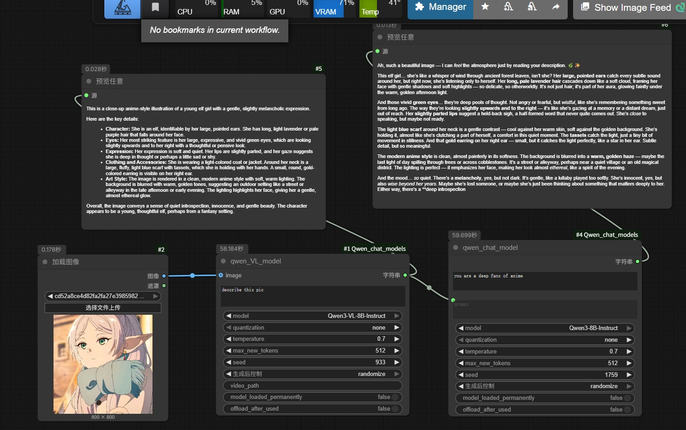
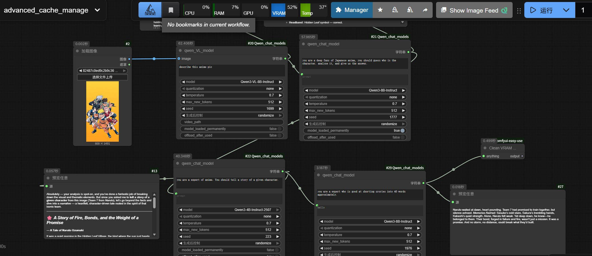

# ComfyUI Qwen chat models node

**语言**: [English](README.md) | **中文**

本项目为 ComfyUI 自定义节点：在工作流里直接调用 **Qwen 文本模型**（Qwen2.5 / Qwen3）与 **Qwen 多模态模型**（Qwen2.5-VL / Qwen3-VL）进行生成。

- 支持纯文本对话与多模态对话（文本 + 可选图片输入）
- 支持 `none / 4bit / 8bit` 量化以降低显存占用（依赖 bitsandbytes）
- 内置 **模型缓存管理**：可选择“常驻显存”或“用完卸载/清理显存”

> 模型会在首次运行节点时自动从 Hugging Face 下载到本地（见下方 Model Storage）。推荐从本地加载。

## Sample Workflows 
### default-max-loaded-models=2
- basic use of nodes:
包含了基本节点的使用方式
[`workflow_example/basic_flow.json`](workflow_example/basic_flow.json)

- advanced use of cache control:你可以看到，当我们开启了预加载模式时，再次调用相同的节点会显著加速。 [`workflow_example/advanced_cache_manage.json`](workflow_example/advanced_cache_manage.json)



## Installation

你可以手动安装：

1. 克隆仓库：

   ```bash
   git clone https://github.com/ConstantlyGrowup/ComfyUI_Qwen_chat_models.git
   ```

2. 进入目录：

   ```bash
   cd ComfyUI_Qwen_chat_models
   ```

3. 安装依赖（建议在 ComfyUI 的虚拟环境中执行）：

   ```bash
   pip install -r requirements.txt
   ```

4. 将本仓库放入 ComfyUI 的自定义节点目录：

   - 推荐路径：`ComfyUI/custom_nodes/ComfyUI_Qwen_chat_models`
   - 或创建 symlink/junction 到该目录
   - Windows 示例：`D:\ComfyUI_windows_portable\ComfyUI\custom_nodes\ComfyUI_Qwen_chat_models`

5. 重启 ComfyUI，在节点分类 `Comfyui_Qwen` 下即可看到本项目节点。

## Supported Nodes

- **QwenVL node (Qwen2.5-VL / Qwen3-VL)**：多模态对话生成（文本 + 可选图片输入）。
- **Qwen node (Qwen2.5 / Qwen3)**：纯文本对话生成（system + user prompt）。

### QwenVL node (multimodal)

- **Inputs (required)**:
  - **text**：用户文本提示（STRING, multiline）
  - **model**：选择 VL checkpoint（下拉列表）
  - **quantization**：`none / 4bit / 8bit`
  - **temperature**：采样温度（FLOAT）
  - **max_new_tokens**：最大生成 token（INT）
  - **seed**：随机种子；`-1` 表示不设置（INT）
- **Inputs (optional)**:
  - **image**：ComfyUI 的 `IMAGE`（传入后会作为对话中的 image content）
  - **video_path**：预留字段（当前实现不读取该路径；后续可扩展）
  - **model_loaded_permanently**：是否将“模型”常驻缓存（BOOLEAN）
  - **offload_after_used**：是否在本次推理结束后卸载模型并清理显存（BOOLEAN）
- **Outputs**:
  - **STRING**：模型回复文本

### Qwen node (text-only)

- **Inputs (required)**:
  - **system**：system 提示词（STRING, multiline）
  - **prompt**：user 提示词（STRING, multiline）
  - **model**：选择文本 checkpoint（下拉列表）
  - **quantization**：`none / 4bit / 8bit`
  - **temperature / max_new_tokens / seed**：同上
- **Inputs (optional)**:
  - **model_loaded_permanently**：是否将“模型”常驻缓存（BOOLEAN）
  - **offload_after_used**：是否在本次推理结束后卸载模型并清理显存（BOOLEAN）
- **Outputs**:
  - **STRING**：模型回复文本

### Cache / VRAM management（重要）

本项目内置一个全局 `ModelCache`，用来在多次调用节点时复用模型、减少重复加载开销，并提供显存释放能力：

- **常驻 (Pinned)**：勾选 `model_loaded_permanently=True` 时，该模型会被 pin 在缓存里，不会被 LRU 淘汰。
- **用完卸载**：勾选 `offload_after_used=True` 时，本次推理结束会主动把该模型从缓存中移除，并尝试清理显存。
- **LRU 淘汰**：当加载的模型数量超过阈值，会按最近最少使用淘汰 *非 pinned* 的模型（只对 `*_model` 生效）。

你可以通过环境变量调整缓存上限：

- `QWEN_MAX_LOADED_MODELS`（默认 `2`）：允许同时保留的模型数量（只统计 `*_model`，processor/tokenizer 不计入且会常驻缓存）。这个限制可以在node.py里面找到。

> 说明：`processor` / `tokenizer` 会被永久缓存（它们通常很轻量）；真正占用显存/内存大头的是 `*_model`。

## Model Storage

下载的模型会存放在：

- `ComfyUI/models/LLM/<model_name>/`

节点会在首次使用某个模型时自动下载（等价于 Hugging Face `snapshot_download` 到上述目录）。

### Supported model names (as of current node lists)

- **VL (QwenVL)**:
  - `Qwen2.5-VL-3B-Instruct`
  - `Qwen2.5-VL-7B-Instruct`
  - `Qwen3-VL-2B-Thinking`, `Qwen3-VL-2B-Instruct`
  - `Qwen3-VL-4B-Thinking`, `Qwen3-VL-4B-Instruct`
  - `Qwen3-VL-8B-Thinking`, `Qwen3-VL-8B-Instruct`
  - `Qwen3-VL-32B-Thinking`, `Qwen3-VL-32B-Instruct`
- **Text (Qwen)**:
  - `Qwen2.5-3B-Instruct`, `Qwen2.5-7B-Instruct`, `Qwen2.5-14B-Instruct`, `Qwen2.5-32B-Instruct`
  - `Qwen3-8B-Instruct`
  - `Qwen3-4B-Thinking-2507`, `Qwen3-4B-Instruct-2507`

## Troubleshooting

- **勾选了 model_loaded_permanently，然后报错 “Cannot load pinned model”**：
  - 说明 pinned 模型数量超过 `QWEN_MAX_LOADED_MODELS`（默认 2）
  - 取消部分节点的 `model_loaded_permanently`，或提高环境变量 `QWEN_MAX_LOADED_MODELS`

- **4bit/8bit 量化不可用 / bitsandbytes 报错**：
  - 需要正确安装 `bitsandbytes`，并确保 CUDA 环境匹配
  - 临时解决：把 `quantization` 设为 `none`

- **CUDA OOM / 显存占用一直不降**：
  - 勾选 `offload_after_used=True` 让节点在推理结束后卸载模型并执行显存清理
  - 或减少 `max_new_tokens`、改用更小模型、使用 4bit/8bit 量化


